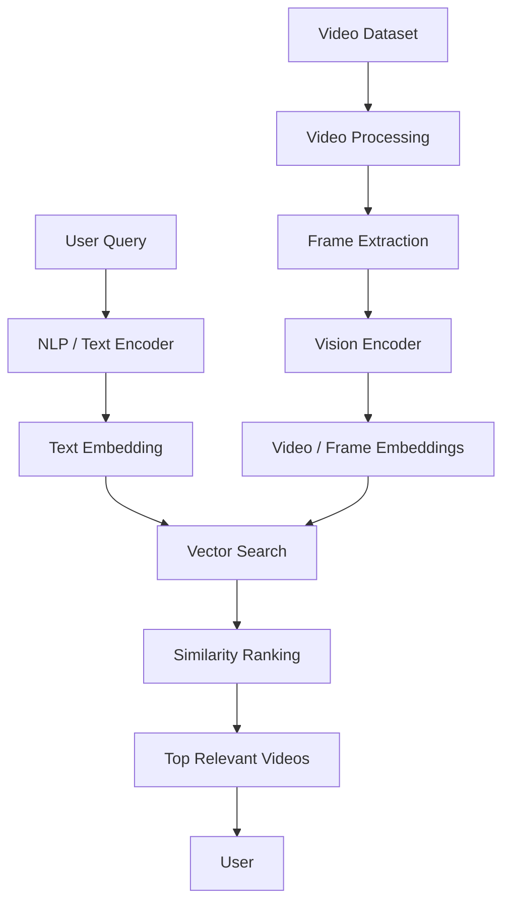
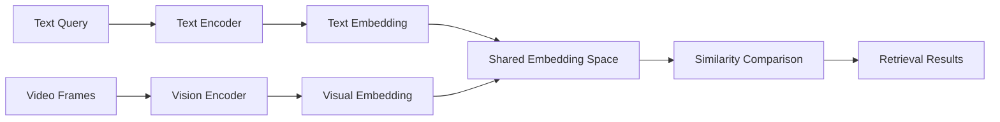
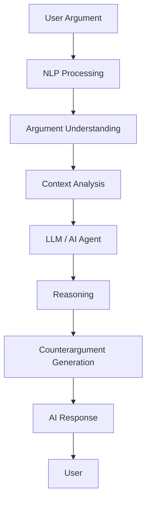
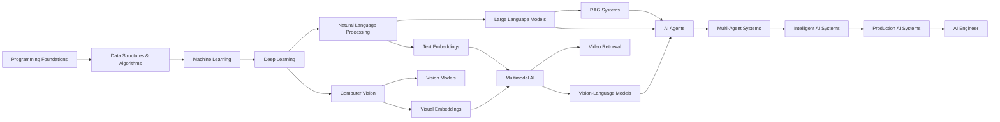

<!-- ========================= -->
<!--          HEADER           -->
<!-- ========================= -->

<h1 align="center">Hi 👋, I'm Hoài Phước</h1>

<h3 align="center">
Artificial Intelligence Student · NLP · AI Agents · Multimodal AI · LLM · Computer Vision
</h3>

<p align="center">
Building practical AI systems that combine language, vision, reasoning, retrieval, and intelligent agents.
</p>

<p align="center">
  <a href="https://github.com/HoaiPhuoc-03">
    
  </a>

  <a href="https://www.linkedin.com/in/hoài-phước-nguyễn-96583541a">
    
  </a>

  <a href="mailto:phuochcmusfit@gmail.com">
    
  </a>

  <a href="https://www.facebook.com/phuoc.nguyenhoai.581/">
    
  </a>
</p>

---

<!-- ========================= -->
<!--         ABOUT ME          -->
<!-- ========================= -->

## 👨‍💻 About Me

I'm **Hoài Phước**, an **Artificial Intelligence student** at the  
**University of Science, Vietnam National University Ho Chi Minh City (HCMUS)**.

My main interests lie at the intersection of **Artificial Intelligence, Natural Language Processing, Large Language Models, AI Agents, Computer Vision, Multimodal AI, and Software Engineering**.

I enjoy building practical AI systems, especially applications involving:

- 💬 Natural Language Processing
- 🧠 Large Language Models
- 🤖 AI Agents
- 🖼️ Multimodal AI
- 👁️ Computer Vision
- 🔎 Retrieval-Augmented Generation
- 📊 Machine Learning
- 🧬 Deep Learning
- 🧠 Intelligent Reasoning
- ⚙️ Backend Integration

Rather than treating AI models as isolated components, I'm interested in designing complete intelligent systems that can understand language, interpret visual information, retrieve knowledge, reason over context, and coordinate multiple AI components.

> **Current Focus:** Building intelligent AI systems that combine NLP, multimodal understanding, LLM reasoning, retrieval, and AI agents.

---

<!-- ========================= -->
<!--     AREAS OF INTEREST     -->
<!-- ========================= -->

## 🧠 Areas of Interest

`Artificial Intelligence`
`Natural Language Processing`
`Large Language Models`
`AI Agents`
`Agentic AI`
`Multimodal AI`
`Vision-Language Models`
`Computer Vision`
`Machine Learning`
`Deep Learning`
`Generative AI`
`RAG`
`Knowledge Representation`
`Intelligent Reasoning`
`Backend Engineering`
`Software Engineering`

---

<!-- ========================= -->
<!--        TECH STACK         -->
<!-- ========================= -->

# 🛠️ Tech Stack

## 💻 Programming Languages

<p>


</p>

---

## 🤖 AI / Machine Learning

<p>


</p>

---

## 💬 Natural Language Processing

<p>


</p>

---

## 👁️ Computer Vision / Multimodal AI

<p>


</p>

---

## 🤖 LLM / AI Agents / RAG

<p>


</p>

<p>


</p>

---

## ⚙️ Backend / Web

<p>


</p>

---

## 🔧 Development Tools

<p>


</p>

---

<!-- ========================= -->
<!--     FEATURED PROJECT      -->
<!-- ========================= -->

# 🚀 Featured Project

## 🎥 Multimodal AI for Video Retrieval

### Multimodal AI · Video Retrieval · NLP · Computer Vision · Embeddings · Semantic Search

**Multimodal AI for Video Retrieval** is an AI-powered system designed to retrieve relevant video content based on natural language queries and visual information.

The project combines **Natural Language Processing, Computer Vision, multimodal embeddings, semantic search, and intelligent retrieval** to connect user queries with semantically relevant video content.

Instead of relying only on keyword-based search, the system focuses on understanding the semantic meaning of both textual queries and visual information extracted from videos.

The goal is to allow users to search for video content using natural language while the system performs semantic matching between the query and indexed video representations.

---

## 🎯 Project Goals

The project focuses on:

- Retrieving videos using natural language queries
- Understanding semantic relationships between text and video
- Extracting useful information from video frames
- Generating text and visual embeddings
- Building multimodal representations
- Performing semantic similarity search
- Ranking videos based on relevance
- Supporting scalable video search
- Improving retrieval beyond traditional keyword matching

---

## 🧩 Input & Retrieval Concept

A user can provide a natural language query such as:

```text
"Find a video where a person is walking on a beach at sunset."
```

The system processes the query and compares its semantic representation against indexed video content.

The general process is:

```text
Natural Language Query
        +
Video Dataset
        +
Frame Information
        +
Visual Embeddings
        +
Semantic Similarity
        =
Relevant Video Results
```

---

## 🏗️ System Architecture



---

## 💬 Natural Language Processing

The NLP component is responsible for understanding user search queries.

Its responsibilities include:

- Query preprocessing
- Natural language understanding
- Semantic interpretation
- Important keyword extraction
- Context understanding
- Text embedding generation

Instead of matching exact keywords, the system represents the meaning of the query in an embedding space.

---

## 👁️ Video & Vision Processing

The computer vision component processes video content.

Typical processing stages include:

- Video decoding
- Frame extraction
- Keyframe selection
- Image preprocessing
- Visual feature extraction
- Scene understanding
- Video representation generation

Selected video frames are passed through a vision encoder to obtain semantic visual representations.

---

## 🧠 Multimodal Embeddings

Both textual and visual information are transformed into vector representations.



The shared embedding space makes it possible to compare textual queries directly against visual video content.

---

## 🔎 Semantic Search

Instead of performing exact keyword matching, the system retrieves videos based on semantic similarity.

```text
Query
  │
  ▼
Text Encoder
  │
  ▼
Query Embedding
  │
  ▼
Vector Similarity Search
  │
  ├── Video Embedding 1
  ├── Video Embedding 2
  ├── Video Embedding 3
  ├── ...
  │
  ▼
Similarity Scores
  │
  ▼
Ranking
  │
  ▼
Top-K Relevant Videos
```

This allows the system to retrieve content even when the exact words in the query do not appear in video metadata.

---

## ⚙️ Retrieval Pipeline

```text
                     ┌────────────────────┐
                     │   Video Dataset    │
                     └─────────┬──────────┘
                               │
                               ▼
                       Frame Extraction
                               │
                               ▼
                         Vision Encoder
                               │
                               ▼
                        Video Embeddings
                               │
                               ▼
                       Vector Database
                               ▲
                               │
User Query                     │
    │                          │
    ▼                          │
NLP Processing                 │
    │                          │
    ▼                          │
Text Encoder                   │
    │                          │
    ▼                          │
Query Embedding ───────────────┘
    │
    ▼
Similarity Search
    │
    ▼
Ranking
    │
    ▼
Top Relevant Videos
```

---

## 🧱 Modular Design

```text
Multimodal Video Retrieval System
│
├── Query Processing
│   ├── NLP Preprocessing
│   ├── Query Understanding
│   └── Text Encoder
│
├── Video Processing
│   ├── Video Decoder
│   ├── Frame Extraction
│   ├── Keyframe Selection
│   └── Vision Encoder
│
├── Embedding Layer
│   ├── Text Embeddings
│   └── Visual Embeddings
│
├── Retrieval Engine
│   ├── Vector Search
│   ├── Similarity Calculation
│   └── Ranking
│
└── Result Generation
    ├── Top-K Selection
    └── Video Results
```

This modular design makes it easier to:

- Replace embedding models
- Experiment with different vision encoders
- Improve NLP components independently
- Change retrieval algorithms
- Add additional modalities
- Scale the video index

---

## 🔧 Main Technologies

`Python`
`Artificial Intelligence`
`Multimodal AI`
`Natural Language Processing`
`Computer Vision`
`Video Retrieval`
`Large Language Models`
`Vision-Language Models`
`Embeddings`
`Semantic Search`
`Vector Search`
`Deep Learning`
`Machine Learning`

---

<!-- ========================= -->
<!--        PROJECT 2          -->
<!-- ========================= -->

# 🗣️ AI Debate Trainer

### NLP · Large Language Models · AI Agents · Argument Analysis · Interactive Learning

**AI Debate Trainer** is an AI-powered application designed to help users practice debating, argumentation, and critical thinking.

The system allows users to interact with an AI-powered opponent in a structured debate environment.

🔗 **Repository:**  
[github.com/HoaiPhuoc-03/AI_Debate_Trainer](https://github.com/HoaiPhuoc-03/AI_Debate_Trainer)

---

## 🎯 Main Goals

The project explores how AI can be used to:

- Understand natural language arguments
- Generate counterarguments
- Analyze user reasoning
- Simulate intelligent debate opponents
- Improve critical thinking
- Provide interactive debate practice
- Generate context-aware responses

---

## 🧠 AI Workflow



---

## 🔧 Technologies

`Python`
`Artificial Intelligence`
`Natural Language Processing`
`Large Language Models`
`AI Agents`
`Prompt Engineering`
`Interactive AI`

---

<!-- ========================= -->
<!--       GITHUB STATS        -->
<!-- ========================= -->

# 📊 GitHub Statistics

<p align="center">


</p>

---

# 🔥 GitHub Streak

<p align="center">


</p>

---

# 📈 Contribution Activity

<p align="center">


</p>

---

<!-- ========================= -->
<!--      CURRENT LEARNING     -->
<!-- ========================= -->

# 🎯 Currently Learning

I'm currently strengthening my knowledge across several areas of Artificial Intelligence and Computer Science.

---

## 🧠 Artificial Intelligence

- Intelligent Agents
- Search Algorithms
- Heuristic Search
- Knowledge Representation
- Reasoning Systems
- AI Problem Solving

---

## 💬 Natural Language Processing

- Text Preprocessing
- Tokenization
- Text Classification
- Sentiment Analysis
- Named Entity Recognition
- Information Extraction
- Text Embeddings
- Semantic Similarity
- Transformer Architectures
- Natural Language Understanding

---

## 🤖 AI Agents

- Intelligent Agent Architecture
- Tool-Using Agents
- Agent Memory
- Planning and Reasoning
- Multi-Agent Systems
- Agent Orchestration
- Function Calling
- Context Management
- Agentic Workflows
- Retrieval-Enhanced Agents

---

## 📊 Machine Learning

- Supervised Learning
- Unsupervised Learning
- Feature Engineering
- Model Evaluation
- Model Selection
- Optimization

---

## 🧬 Deep Learning

- Neural Networks
- Backpropagation
- Optimization
- Representation Learning
- Convolutional Neural Networks
- Deep Learning Architectures

---

## 👁️ Computer Vision

- Image Classification
- Object Detection
- Segmentation
- Feature Extraction
- Visual Representation Learning
- Video Understanding
- Visual Search

---

## 🖼️ Multimodal AI

- Vision-Language Models
- Image + Text Reasoning
- Video + Text Retrieval
- Multimodal Embeddings
- Multimodal Fusion
- Cross-Modal Representation
- Visual Question Answering
- Multimodal Reasoning

---

## 🧠 Large Language Models

- Prompt Engineering
- LLM Applications
- Retrieval-Augmented Generation
- Embeddings
- Context Management
- Tool Use
- LLM Evaluation
- Reasoning Systems

---

## 🎮 Reinforcement Learning

- Agents
- Environments
- Rewards
- Policies
- Value Functions
- Sequential Decision Making

---

## 💻 Computer Science

- Data Structures
- Algorithms
- Object-Oriented Programming
- Computer Networks
- Backend Development
- Software Engineering
- System Design

---

<!-- ========================= -->
<!--          ROADMAP          -->
<!-- ========================= -->

# 🗺️ AI Engineering Roadmap



---

<!-- ========================= -->
<!--          CONNECT          -->
<!-- ========================= -->

# 🤝 Let's Connect

I'm interested in discussing and exploring:

- 🤖 Artificial Intelligence
- 💬 Natural Language Processing
- 🧠 Large Language Models
- 🤝 AI Agents
- 🔎 Retrieval-Augmented Generation
- 🎥 Video Retrieval
- 🖼️ Multimodal AI
- 👁️ Computer Vision
- 📊 Machine Learning
- 🧬 Deep Learning
- 💻 Software Engineering
- 🚀 Intelligent AI Systems

<p align="center">

<a href="https://github.com/HoaiPhuoc-03">

</a>

<a href="https://www.linkedin.com/in/hoài-phước-nguyễn-96583541a">

</a>

<a href="mailto:phuochcmusfit@gmail.com">

</a>

<a href="https://www.facebook.com/phuoc.nguyenhoai.581/">

</a>

</p>

---

<h3 align="center">
🚀 Learn · Build · Experiment · Improve
</h3>

<p align="center">
<i>"The best way to understand intelligent systems is to build them."</i>
</p>
