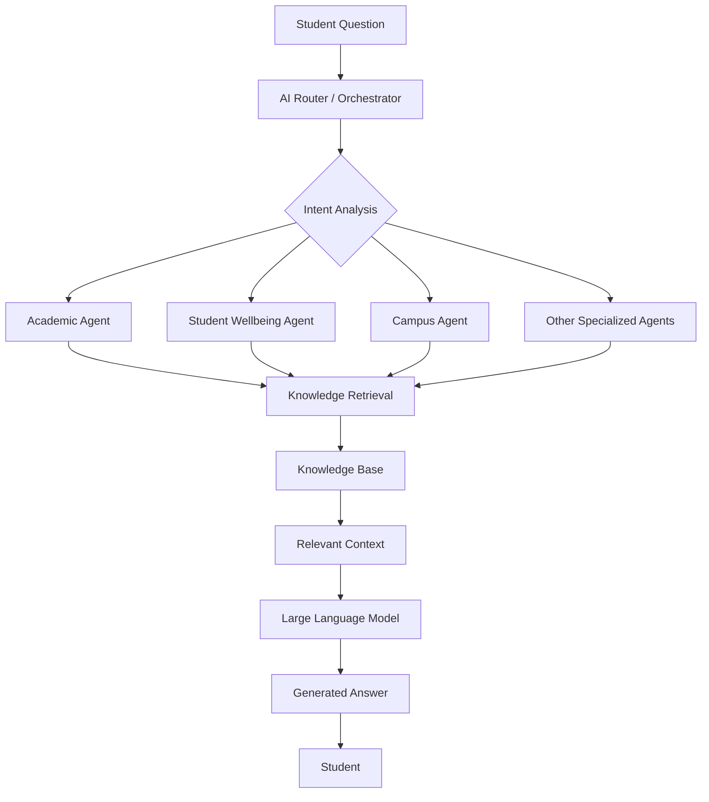
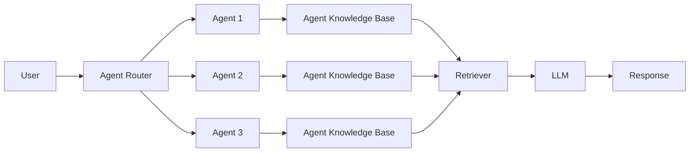
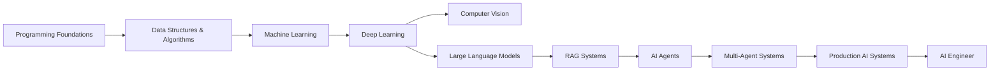

<!-- ========================= -->
<!--         HEADER            -->
<!-- ========================= -->

<h1 align="center">Hi 👋, I'm Hoài Phước</h1>

<h3 align="center">
Artificial Intelligence Student · AI Agents · LLM & RAG Applications
</h3>

<p align="center">
Building practical AI systems by combining intelligent models, retrieval systems, agents, and software engineering.
</p>

<p align="center">
  <a href="https://github.com/HoaiPhuoc-03">
    
  </a>

  <a href="YOUR_LINKEDIN_URL">
    
  </a>

  <a href="mailto:YOUR_EMAIL">
    
  </a>
</p>

---

<!-- ========================= -->
<!--         ABOUT ME          -->
<!-- ========================= -->

## 👨‍💻 About Me

I'm **Hoài Phước**, an **Artificial Intelligence student** at the  
**University of Science, Vietnam National University Ho Chi Minh City (HCMUS)**.

My main interest lies at the intersection of **Artificial Intelligence and Software Engineering**.

I enjoy transforming AI concepts into practical applications, especially systems involving **Large Language Models, Retrieval-Augmented Generation, AI Agents, Machine Learning, and intelligent knowledge systems**.

Rather than working only with standalone AI models, I'm interested in building the complete systems around them:

- 🧠 AI Agents
- 🔎 Retrieval-Augmented Generation
- 🗃️ Knowledge Bases
- 🤖 Large Language Models
- 🔗 APIs & Backend Services
- 📊 Machine Learning
- 🧬 Deep Learning
- 👁️ Computer Vision
- ⚙️ AI System Architecture

> **Current Focus:** Building AI systems that can retrieve, reason, use specialized knowledge, and interact with users intelligently.

---

<!-- ========================= -->
<!--     AREAS OF INTEREST     -->
<!-- ========================= -->

## 🧠 Areas of Interest

`Artificial Intelligence`
`Generative AI`
`Large Language Models`
`RAG`
`AI Agents`
`Machine Learning`
`Deep Learning`
`Computer Vision`
`Knowledge Representation`
`Backend Engineering`
`Algorithms`
`Software Engineering`

---

<!-- ========================= -->
<!--        TECH STACK         -->
<!-- ========================= -->

# 🛠️ Tech Stack

## 💻 Programming Languages

<p>


</p>

---

## 🤖 AI / Machine Learning

<p>


</p>

---

## 🧠 LLM / RAG / AI Agents

<p>


</p>

<p>


</p>

---

## ⚙️ Backend / Web

<p>


</p>

---

## 🔧 Development Tools

<p>


</p>

---

<!-- ========================= -->
<!--     FEATURED PROJECT      -->
<!-- ========================= -->

# 🚀 Featured Project

## 🏫 HCMUS Smart Campus

### Multi-Agent AI · RAG · LLM · Knowledge Base · Intelligent Student Assistant

**HCMUS Smart Campus** is an AI-powered platform designed to provide intelligent assistance for students at the University of Science, VNU-HCM.

The system uses a **multi-agent architecture**, where specialized AI agents are responsible for different areas of student life.

Instead of relying on a single general-purpose chatbot, each agent is provided with specialized knowledge and responsibilities.

### 🎯 Main Goals

The project aims to build an intelligent university assistant capable of:

- Answering university-related questions
- Supporting academic activities
- Providing student wellbeing information
- Retrieving information from specialized knowledge sources
- Routing questions to the appropriate AI agent
- Generating context-aware responses
- Reducing hallucinations through retrieval-based knowledge
- Providing a scalable architecture for additional agents

---

## 🤖 Multi-Agent System

The system contains multiple specialized AI agents.

Examples include:

### 📚 Academic Agent

Handles questions related to:

- Courses
- Learning
- Academic information
- Study guidance
- Academic resources

### ❤️ Student Wellbeing Agent

Provides information related to:

- Student wellbeing
- Stress management
- University life
- Support resources
- Healthy study habits

### 🏫 Campus Information Agent

Handles information related to:

- University facilities
- Student services
- Campus information
- Procedures
- Frequently asked university questions

Each agent operates on a specialized knowledge domain, allowing the overall system to produce more relevant and reliable answers.

---

## 🔎 RAG Knowledge Architecture

The system uses a **Retrieval-Augmented Generation architecture**.

Instead of asking the LLM to answer purely from its pretrained knowledge, the system retrieves relevant information from a curated knowledge base.

The workflow is approximately:



This architecture allows agents to answer questions using external knowledge instead of relying entirely on the LLM's internal memory.

---

## 🧠 Agent Knowledge System

Each AI agent can access specialized knowledge sources containing domain-specific information.



The separation of knowledge between agents allows the system to scale as additional student services are introduced.

---

## ⚙️ AI Pipeline

```text
User
 │
 ▼
Application Interface
 │
 ▼
AI Orchestrator
 │
 ├── Intent Detection
 │
 ├── Agent Selection
 │
 └── Context Management
 │
 ▼
Specialized AI Agent
 │
 ▼
Knowledge Retrieval
 │
 ▼
Relevant Documents
 │
 ▼
LLM
 │
 ▼
Response Generation
 │
 ▼
User
```

---

## 🔧 Technologies

`Python`
`LLM`
`RAG`
`AI Agents`
`Knowledge Base`
`Vector Search`
`Prompt Engineering`
`FastAPI`
`Machine Learning`
`Git`
`GitHub`

---

<!-- ========================= -->
<!--      PROJECT 2            -->
<!-- ========================= -->

# 🗣️ AI Debate Trainer

**AI Debate Trainer** is an AI-powered application designed to help users improve their debating and argumentation skills.

The system allows users to interact with an AI opponent and practice constructing arguments in a structured debate environment.

🔗 **Repository:**  
[github.com/HoaiPhuoc-03/AI_Debate_Trainer](https://github.com/HoaiPhuoc-03/AI_Debate_Trainer)

### 🎯 Project Goals

The project explores how Large Language Models can be used to:

- Generate counterarguments
- Analyze user arguments
- Simulate debate opponents
- Improve critical thinking
- Provide interactive learning experiences
- Evaluate argument structure

### 🧠 Technologies

`Python` · `Artificial Intelligence` · `LLM` · `Prompt Engineering`

---

<!-- ========================= -->
<!--       OTHER PROJECTS      -->
<!-- ========================= -->

# 📚 Other Projects

## 🧠 Artificial Intelligence

A collection of projects and experiments related to Artificial Intelligence.

🔗 [AI Repository](https://github.com/HoaiPhuoc-03/AI)

---

## 💻 Data Structures & Algorithms

I continuously practice algorithms and data structures to strengthen my problem-solving and software engineering foundations.

Topics include:

- Arrays
- Linked Lists
- Stack & Queue
- Trees
- Binary Search Trees
- Graph Algorithms
- DFS / BFS
- Sorting Algorithms
- Backtracking
- Dynamic Programming
- Complexity Analysis

---

<!-- ========================= -->
<!--       GITHUB STATS        -->
<!-- ========================= -->

# 📊 GitHub Statistics

<p align="center">


</p>

---

# 🔥 GitHub Streak

<p align="center">


</p>

---

# 📈 Contribution Activity

<p align="center">


</p>

---

<!-- ========================= -->
<!--       CURRENT STUDY       -->
<!-- ========================= -->

# 🎯 Currently Learning

I'm currently strengthening my knowledge in:

### 🧠 Artificial Intelligence

- Artificial Intelligence fundamentals
- Search algorithms
- Knowledge representation
- Intelligent agents
- Heuristic search

### 📊 Machine Learning

- Supervised Learning
- Unsupervised Learning
- Feature Engineering
- Model Evaluation
- Optimization

### 🧬 Deep Learning

- Neural Networks
- Backpropagation
- CNNs
- Representation Learning
- Optimization

### 👁️ Computer Vision

- Image Classification
- Object Detection
- Segmentation
- Feature Extraction

### 🤖 Large Language Models

- Prompt Engineering
- RAG
- Embeddings
- Vector Databases
- AI Agents
- Context Management
- LLM Evaluation

### 🎮 Reinforcement Learning

- Agents
- Environments
- Rewards
- Policies
- Value Functions
- Sequential Decision Making

### 💻 Computer Science

- Data Structures
- Algorithms
- Object-Oriented Programming
- Computer Networks
- Software Engineering
- Backend Development

---

<!-- ========================= -->
<!--        ROADMAP            -->
<!-- ========================= -->

# 🗺️ My AI Engineering Roadmap



---

<!-- ========================= -->
<!--       CONNECT             -->
<!-- ========================= -->

# 🤝 Let's Connect

I'm interested in discussing:

- 🤖 Artificial Intelligence
- 🧠 Large Language Models
- 🔎 Retrieval-Augmented Generation
- 🤝 AI Agents
- 📊 Machine Learning
- 🧬 Deep Learning
- 👁️ Computer Vision
- 💻 Software Engineering
- 🚀 AI Projects

<p align="center">

<a href="https://github.com/HoaiPhuoc-03">

</a>

<a href="www.linkedin.com/in/hoài-phước-nguyễn-96583541a">

</a>

<a href="phuochcmusfit@gmail.com">

</a>

</p>

---

<h3 align="center">
🚀 Learn · Build · Experiment · Improve
</h3>

<p align="center">
<i>"The best way to understand intelligent systems is to build them."</i>
</p>
