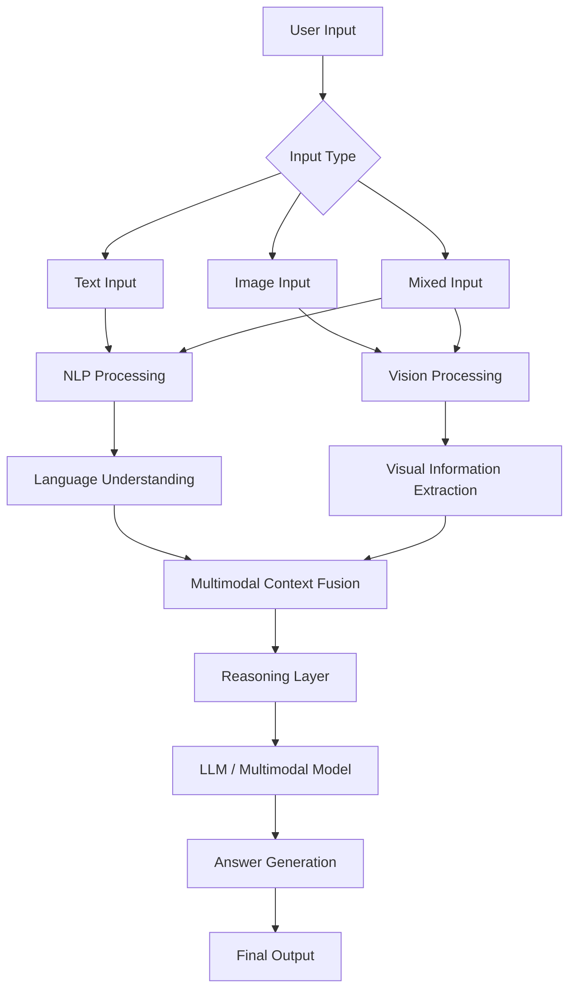
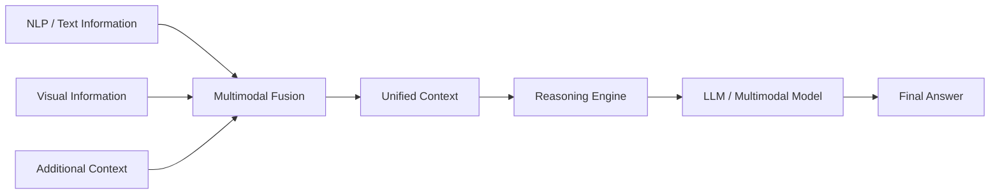
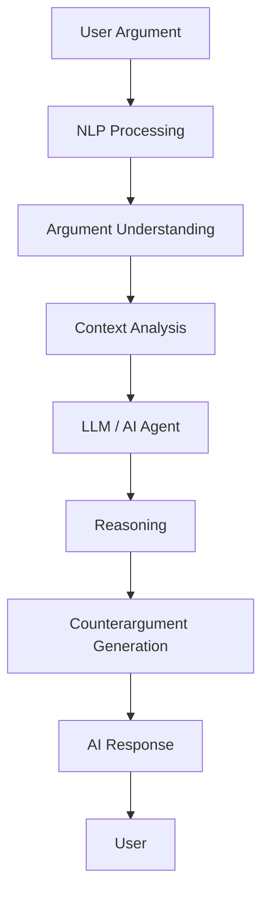
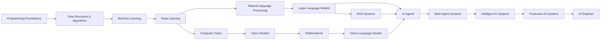

<!-- ========================= -->
<!--          HEADER           -->
<!-- ========================= -->

<h1 align="center">Hi 👋, I'm Hoài Phước</h1>

<h3 align="center">
Artificial Intelligence Student · NLP · AI Agents · Multimodal AI · LLM · Computer Vision
</h3>

<p align="center">
Building practical AI systems that combine language, vision, reasoning, retrieval, and intelligent agents.
</p>

<p align="center">
  <a href="https://github.com/HoaiPhuoc-03">
    
  </a>

  <a href="https://www.linkedin.com/in/hoài-phước-nguyễn-96583541a">
    
  </a>

  <a href="mailto:phuochcmusfit@gmail.com">
    
  </a>
</p>

---

<!-- ========================= -->
<!--         ABOUT ME          -->
<!-- ========================= -->

## 👨‍💻 About Me

I'm **Hoài Phước**, an **Artificial Intelligence student** at the  
**University of Science, Vietnam National University Ho Chi Minh City (HCMUS)**.

My main interests lie at the intersection of **Artificial Intelligence, Natural Language Processing, Large Language Models, AI Agents, Computer Vision, Multimodal AI, and Software Engineering**.

I enjoy building practical AI systems, especially applications involving:

- 💬 Natural Language Processing
- 🧠 Large Language Models
- 🤖 AI Agents
- 🖼️ Multimodal AI
- 👁️ Computer Vision
- 🔎 Retrieval-Augmented Generation
- 📊 Machine Learning
- 🧬 Deep Learning
- 🧠 Intelligent Reasoning
- ⚙️ Backend Integration

Rather than treating AI models as isolated components, I'm interested in designing complete intelligent systems that can understand language, interpret visual information, retrieve knowledge, reason over context, and coordinate multiple AI components.

> **Current Focus:** Building intelligent AI systems that combine NLP, multimodal understanding, LLM reasoning, retrieval, and AI agents.

---

<!-- ========================= -->
<!--     AREAS OF INTEREST     -->
<!-- ========================= -->

## 🧠 Areas of Interest

`Artificial Intelligence`
`Natural Language Processing`
`Large Language Models`
`AI Agents`
`Agentic AI`
`Multimodal AI`
`Vision-Language Models`
`Computer Vision`
`Machine Learning`
`Deep Learning`
`Generative AI`
`RAG`
`Knowledge Representation`
`Intelligent Reasoning`
`Backend Engineering`
`Software Engineering`

---

<!-- ========================= -->
<!--        TECH STACK         -->
<!-- ========================= -->

# 🛠️ Tech Stack

## 💻 Programming Languages

<p>


</p>

---

## 🤖 AI / Machine Learning

<p>


</p>

---

## 💬 Natural Language Processing

<p>


</p>

---

## 👁️ Computer Vision / Multimodal AI

<p>


</p>

---

## 🤖 LLM / AI Agents / RAG

<p>


</p>

<p>


</p>

---

## ⚙️ Backend / Web

<p>


</p>

---

## 🔧 Development Tools

<p>


</p>

---

<!-- ========================= -->
<!--     FEATURED PROJECT      -->
<!-- ========================= -->

# 🚀 Featured Project

## 🧠 Multimodel for Contest

### Multimodal AI · Vision-Language Models · LLM · NLP · Computer Vision · Intelligent Reasoning

**Multimodel for Contest** is an AI-powered system designed to solve contest-style problems by combining multiple AI capabilities in a unified pipeline.

Instead of relying on a single model or one type of input, the project focuses on combining different modalities and reasoning components such as:

- 📝 Text
- 🖼️ Images
- 📊 Visual information
- 💬 Natural language understanding
- 🤖 Large Language Models
- 🧠 Intelligent reasoning

The goal is to build a flexible AI system capable of interpreting complex contest problems, extracting relevant information from multiple input types, combining that information, and generating context-aware solutions.

---

## 🎯 Project Goals

The project focuses on:

- Processing both textual and visual inputs
- Understanding natural language questions
- Extracting relevant information from images
- Combining visual understanding with language reasoning
- Designing modular multimodal AI pipelines
- Integrating multiple AI models
- Supporting cross-modal reasoning
- Improving robustness for complex problem-solving tasks

---

## 🧩 Supported Inputs

The system is designed to work with contest problems containing combinations such as:

```text
Text Question
     +
Natural Language Context
     +
Image
     +
Diagram
     +
Visual Information
     +
Reasoning Requirement
```

Instead of processing each component independently, the system combines them into a unified representation of the original problem.

---

## 🏗️ Multimodal Architecture



---

## 💬 Natural Language Processing

The NLP component processes textual information from contest problems.

Its responsibilities include:

- Text preprocessing
- Question understanding
- Key information extraction
- Context analysis
- Semantic interpretation
- Prompt construction
- Reasoning preparation

The resulting language representation is later combined with visual information for multimodal reasoning.

---

## 👁️ Vision Processing

The vision component is responsible for understanding visual inputs.

Possible tasks include:

- Image understanding
- Object recognition
- Diagram interpretation
- Visual feature extraction
- Scene understanding
- Visual question answering

The extracted visual information is converted into structured context that can be used by downstream reasoning components.

---

## 🔄 Multimodal Fusion

One of the central components of the system is the fusion of information from multiple modalities.



The goal is to create a unified representation that captures both linguistic and visual information.

---

## 🧠 Reasoning Layer

After information from different modalities is combined, the reasoning layer processes the unified context.

The reasoning component may perform:

- Problem decomposition
- Context analysis
- Step-by-step reasoning
- Cross-modal reasoning
- Information synthesis
- Answer verification
- Response generation

This allows the system to reason over both language and visual information instead of treating them independently.

---

## ⚙️ AI Pipeline

```text
User Input
   │
   ▼
Input Handler
   │
   ├── NLP Processor
   │
   └── Vision Processor
            │
            ▼
    Information Extraction
            │
            ▼
      Context Fusion
            │
            ▼
      Reasoning Engine
            │
            ▼
    Multimodal / LLM Model
            │
            ▼
      Answer Generation
            │
            ▼
         Output
```

---

## 🧱 Modular Design

```text
Multimodel for Contest
│
├── Input Handler
│
├── NLP Processing Module
│
├── Vision Processing Module
│
├── Information Extraction
│
├── Context Builder
│
├── Multimodal Fusion
│
├── Reasoning Engine
│
├── Model Orchestrator
│
└── Output Generator
```

The modular design makes it easier to:

- Replace individual models
- Experiment with different architectures
- Add new modalities
- Evaluate individual pipeline stages
- Improve components independently

---

## 🔧 Main Technologies

`Python`
`Artificial Intelligence`
`Natural Language Processing`
`Multimodal AI`
`Large Language Models`
`Vision-Language Models`
`Computer Vision`
`Machine Learning`
`Deep Learning`
`Prompt Engineering`
`Intelligent Reasoning`
`API Integration`

---

<!-- ========================= -->
<!--        PROJECT 2          -->
<!-- ========================= -->

# 🗣️ AI Debate Trainer

### NLP · Large Language Models · AI Agents · Argument Analysis · Interactive Learning

**AI Debate Trainer** is an AI-powered application designed to help users practice debating, argumentation, and critical thinking.

The system allows users to interact with an AI-powered opponent in a structured debate environment.

🔗 **Repository:**  
[github.com/HoaiPhuoc-03/AI_Debate_Trainer](https://github.com/HoaiPhuoc-03/AI_Debate_Trainer)

---

## 🎯 Main Goals

The project explores how AI can be used to:

- Understand natural language arguments
- Generate counterarguments
- Analyze user reasoning
- Simulate intelligent debate opponents
- Improve critical thinking
- Provide interactive debate practice
- Generate context-aware responses

---

## 🧠 AI Workflow



---

## 🔧 Technologies

`Python`
`Artificial Intelligence`
`Natural Language Processing`
`Large Language Models`
`AI Agents`
`Prompt Engineering`
`Interactive AI`

---

<!-- ========================= -->
<!--       GITHUB STATS        -->
<!-- ========================= -->

# 📊 GitHub Statistics

<p align="center">


</p>

---

# 🔥 GitHub Streak

<p align="center">


</p>

---

# 📈 Contribution Activity

<p align="center">


</p>

---

<!-- ========================= -->
<!--      CURRENT LEARNING     -->
<!-- ========================= -->

# 🎯 Currently Learning

I'm currently strengthening my knowledge across several areas of Artificial Intelligence and Computer Science.

---

## 🧠 Artificial Intelligence

- Intelligent Agents
- Search Algorithms
- Heuristic Search
- Knowledge Representation
- Reasoning Systems
- AI Problem Solving

---

## 💬 Natural Language Processing

- Text Preprocessing
- Tokenization
- Text Classification
- Sentiment Analysis
- Named Entity Recognition
- Information Extraction
- Text Embeddings
- Semantic Similarity
- Transformer Architectures
- Natural Language Understanding

---

## 🤖 AI Agents

- Intelligent Agent Architecture
- Tool-Using Agents
- Agent Memory
- Planning and Reasoning
- Multi-Agent Systems
- Agent Orchestration
- Function Calling
- Context Management
- Agentic Workflows
- Retrieval-Enhanced Agents

---

## 📊 Machine Learning

- Supervised Learning
- Unsupervised Learning
- Feature Engineering
- Model Evaluation
- Model Selection
- Optimization

---

## 🧬 Deep Learning

- Neural Networks
- Backpropagation
- Optimization
- Representation Learning
- Convolutional Neural Networks
- Deep Learning Architectures

---

## 👁️ Computer Vision

- Image Classification
- Object Detection
- Segmentation
- Feature Extraction
- Visual Representation Learning
- Visual Understanding

---

## 🖼️ Multimodal AI

- Vision-Language Models
- Image + Text Reasoning
- Multimodal Fusion
- Cross-Modal Representation
- Visual Question Answering
- Multimodal Reasoning

---

## 🧠 Large Language Models

- Prompt Engineering
- LLM Applications
- Retrieval-Augmented Generation
- Embeddings
- Context Management
- Tool Use
- LLM Evaluation
- Reasoning Systems

---

## 🎮 Reinforcement Learning

- Agents
- Environments
- Rewards
- Policies
- Value Functions
- Sequential Decision Making

---

## 💻 Computer Science

- Data Structures
- Algorithms
- Object-Oriented Programming
- Computer Networks
- Backend Development
- Software Engineering
- System Design

---

<!-- ========================= -->
<!--          ROADMAP          -->
<!-- ========================= -->

# 🗺️ AI Engineering Roadmap



---

<!-- ========================= -->
<!--          CONNECT          -->
<!-- ========================= -->

# 🤝 Let's Connect

I'm interested in discussing and exploring:

- 🤖 Artificial Intelligence
- 💬 Natural Language Processing
- 🧠 Large Language Models
- 🤝 AI Agents
- 🔎 Retrieval-Augmented Generation
- 🖼️ Multimodal AI
- 👁️ Computer Vision
- 📊 Machine Learning
- 🧬 Deep Learning
- 💻 Software Engineering
- 🚀 Intelligent AI Systems

<p align="center">

<a href="https://github.com/HoaiPhuoc-03">

</a>

<a href="https://www.linkedin.com/in/hoài-phước-nguyễn-96583541a">

</a>

<a href="mailto:phuochcmusfit@gmail.com">

</a>

</p>

---

<h3 align="center">
🚀 Learn · Build · Experiment · Improve
</h3>

<p align="center">
<i>"The best way to understand intelligent systems is to build them."</i>
</p>
